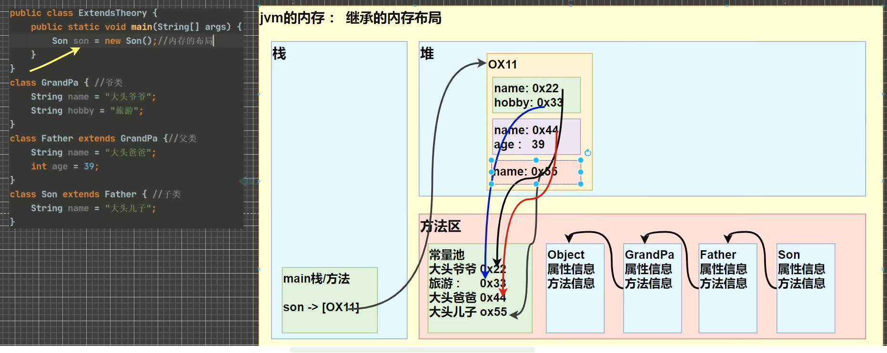

# object.md

## 访问修饰符

----

|    修饰符    | 类内部 | 同一个包 | 子类  | 其他包 |
|:---------:|:---:|:----:|:---:|:---:|
|  public   |  Y  |  Y   |  Y  |  Y  |
| protected |  Y  |  Y   |  Y  |  N  |
|  default  |  Y  |  Y   |  N  |  N  |
|  private  |  Y  |  N   |  N  |  N  |

其实一般情况下，我们只用到了public和private两种修饰符，protected和default修饰符很少用到。

protected修饰符的作用是，让子类可以访问父类的成员变量和成员方法

## 继承

1. 子类继承了所有父类的成员变量和成员方法，但是不能继承父类的构造方法
2. 子类在创造一个对象的时候一定会调用父类的构造方法，如果没有显式的调用父类的构造方法，那么编译器会自动调用父类的无参构造方法
3. 如果父类没有无参构造方法，那么子类必须显式的调用父类的有参构造方法，否则编译不会通过
4. super()和this()都必须放在构造方法的第一行，因为它们都是用来调用构造方法的，不能共存
5. Object类是所有类的父类，所有类都继承了Object类的方法，Object类的方法可以被所有类使用
6. 父类的调用不限于直接父类，可以是间接父类，只要是继承关系就会被调用，直到Object类
7. java是单继承的，一个类只能继承一个父类，但是可以多重继承，即一个子类可以继承多个父类的成员变量和成员方法

```java
class GrandFather {
    String name = "GrandFather";
}

class Father extends GrandFather {
    String name = "Father";
}

class Son extends Father {
    String name = "Son";
}
```


其实这里也就是一种作用域链的问题，当我们调用一个变量的时候，首先会在当前类中查找，如果没有找到，那么就会去父类中查找，如果还没有找到，那么就会去父类的父类中查找，直到Object类，如果还没有找到，那么就会报错。

### super关键字

super关键字可以用来调用父类的成员变量和成员方法，也可以用来调用父类的构造方法

|  super关键字  | 作用 |
|:---------:|:---:|
| super()   | 调用父类的构造方法 |
| super.成员变量 | 调用父类的成员变量 |
| super.成员方法 | 调用父类的成员方法 |

### this关键字

this关键字可以用来调用本类的成员变量和成员方法，也可以用来调用本类的构造方法

|  this关键字  | 作用 |
|:---------:|:---:|
| this()   | 调用本类的构造方法 |
| this.成员变量 | 调用本类的成员变量 |
| this.成员方法 | 调用本类的成员方法 |

### this和super的区别

| 区别点 | this |   super   | 
|:---:|:---:|:---------:|
| 访问属性 | 访问本类的属性，如果本类没有，就会去父类中查找 | 从父类开始查找方法 |
| 访问方法 | 访问本类的方法，如果本类没有，就会去父类中查找 | 从父类开始查找方法 |
| 访问构造方法 | 调用本类构造器，必须放在第一行 | 调用父类构造器，必须放在第一行 |
| 特殊 | 表示当前对象 | 表示父类对象 |

## 重写(override)

> 简单来说，就是子类重写了父类的方法，具有相同的返回值类型、方法名、参数列表，这就是重写

### 细节

1. 子类方法的返回值类型必须小于等于父类方法的返回值类型，也就是说子类方法的返回值类型可以是父类方法的返回值类型的子类
2. 子类方法的访问权限必须大于等于父类方法的访问权限，也就是说子类不能缩小父类的访问权限

## 重载

> 简单来说，就是在同一个类中，方法名相同，参数列表不同，这就是重载

### 重写和重载的区别

| 区别点 | 重写 | 重载 |
|:---:|:---:|:---:|
| 参数列表 | 参数列表必须相同 | 参数列表可以不同 |
| 返回值类型 | 返回值类型必须相同 | 返回值类型可以不同 |
| 访问权限 | 访问权限必须大于等于父类方法的访问权限 | 访问权限可以不同 |
| 作用 | 重写父类的方法 | 重载父类的方法 |

## 多态(polymorphism)

> 多态是指同一个对象在不同的情况下表现出不同的状态
> 多态的前提是继承或者实现，多态的表现形式有两种：重写和重载

### 方法的多态

1. 方法的多态是指子类重写了父类的方法，当我们调用子类的方法的时候，实际上是调用了子类重写的方法
2. 方法的多态是编译时多态，也就是说多态的表现形式是在编译的时候就确定下来了，而不是在运行的时候才确定下来的
3. 方法的多态是通过方法的重写实现的
4. 方法的多态是通过父类的引用指向子类的对象实现的

```java
class Animal {
    public void eat() {
        System.out.println("动物吃东西");
    }
}

class Cat extends Animal {
    public void eat() {
        System.out.println("猫吃鱼");
    }
}

public class Test {
    public static void main(String[] args) {
        Animal animal = new Cat();
        animal.eat();
    }
}
```

### 对象的多态

1. 对象的多态是指父类的引用指向子类的对象，这样的话，我们调用父类的方法的时候，实际上是调用了子类重写的方法
2. 对象的多态是运行时多态，也就是说多态的表现形式是在运行的时候才确定下来的
3. 对象的多态是通过方法的重写实现的
4. 对象的多态是通过父类的引用指向子类的对象实现的
5.

```java
class Animal {
    public void eat() {
        System.out.println("动物吃东西");
    }
}

class Cat extends Animal {
    public void eat() {
        System.out.println("猫吃鱼");
    }
}

class Dog extends Animal {
    public void eat() {
        System.out.println("狗吃肉");
    }
}

class Pig extends Animal {
    public void eat() {
        System.out.println("猪吃饲料");
    }
}

public class Test {
    public static void main(String[] args) {
        Animal a = new Cat();
        a.eat();
        a = new Dog();
        a.eat();
        a = new Pig();
        a.eat();
    }
}
```

> 对象的多态基本就是java的核心了

1. 一个对象的编译类型和运行类型可以不一样
2. 编译类型在定义对象时，就确定了，不能改变
3. 运行类型是可以变化的
4. **编译类型看定义时 = 号左边，运行类型看 = 号右边**

### 向上转型
1. 本质：父类的引用指向子类的对象
2. 语法：父类类型 变量名 = new 子类类型();
3. 特点：编译类型看左边，运行类型看右边
4. 可以调用父类中的所有”东西“
5. 不能调用子类中特有的”东西“ 

### 向下转型
1. 本质：子类的引用指向父类的对象
2. 语法：子类类型 变量名 = (子类类型) 父类类型的变量名;
3. 只能强转父类的引用，不能强转父类的类型
4. 要求父类的引用必须指向的是当前目标类型的对象
5. 向下转型之后，可以调用子类中的所有”东西“

### instanceof
instance of 是一个二元操作符，左边是一个对象，右边是一个类，如果左边的对象是右边的类的实例，那么返回true，否则返回false
。具体是在判断对象的运行类型是不是XX类型或XX的子类型。

315
