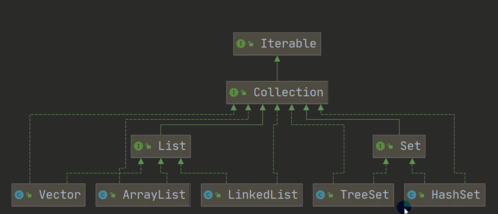
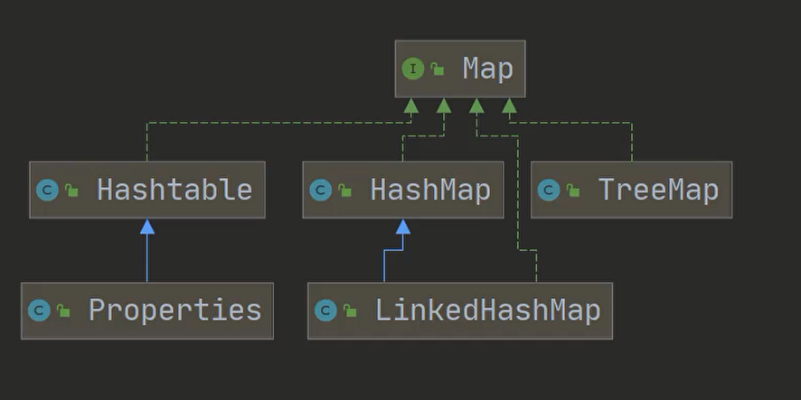

# 集合




## Collection接口

**常用方法：**

1. add：添加单个元素
2. remove：删除单个元素
3. contains：判断是否包含某个元素
4. isEmpty：判断是否为空
5. size：返回集合大小
6. clear：清空集合
7. toArray：转换为数组
8. iterator：返回迭代器
9. addAll：添加另一个集合(添加多个元素)
10. removeAll：删除多个元素
11. containsAll：判断是否包含另一个集合

**迭代器：**

1. hasNext：判断是否有下一个元素
2. next：返回下一个元素

```java
import java.util.ArrayList;
import java.util.Collection;
import java.util.Iterator;

@SuppressWarnings("all")
public class CollectionInterface {
    public static void main(String[] args) {
        Collection col = new ArrayList();
        col.add("a");
        col.add(10);
        col.add(true);
        Iterator iterator = col.iterator();
        while (iterator.hasNext()) {
            Object obj = iterator.next();
            System.out.println(obj);
        }
    }
}

```

### List接口
> 有序，可重复，有索引

**实现子类：**
1. ArrayList：底层是数组，查询快，增删慢
2. LinkedList：底层是链表，查询慢，增删快
3. Vector：底层是数组，线程安全，效率低

**常用方法：**
1. add：添加单个元素
2. addAll：添加另一个集合(添加多个元素)
3. get：获取指定索引的元素
4. set：修改指定索引的元素
5. indexOf：返回指定元素的索引
6. remove：删除指定索引的元素
7. subList：返回指定索引的子集合

```java

```


### Set接口