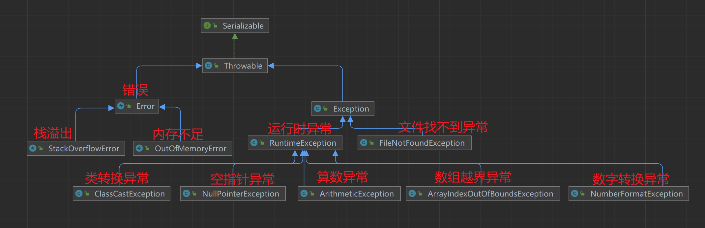
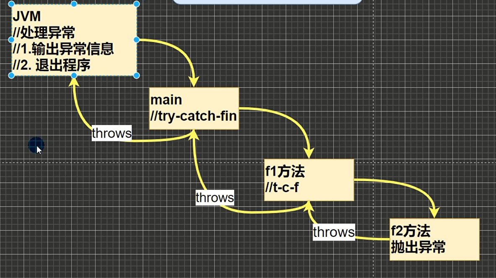

# 异常

## 基本概念
程序执行中所发生的异常事件可以分为两大类
1. Error(错误)：程序无法处理的错误，如内存溢出
2. Exception(异常)：程序可以处理的异常，如除数为0



## 异常的处理方式
1. try-catch-finally
2. throws

```java
public class ExceptionDemo {
    public static void main(String[] args) {
        int[] arr = {1, 2, 3};
        int e = getElement(arr, 3);
        System.out.println(e);
    }

    public static int getElement(int[] arr, int index) {
        int ele = arr[index];
        return ele;
    }
}
```

```java
public class ExceptionDemo {
    public static void main(String[] args) {
        int[] arr = {1, 2, 3};
        int e = getElement(arr, 3);
        System.out.println(e);
    }

    public static int getElement(int[] arr, int index) {
        int ele = 0;
        try {
            ele = arr[index];
        } catch (ArrayIndexOutOfBoundsException e) {
            System.out.println("数组越界异常");
        } catch (Exception e) {
            System.out.println("异常");
        } finally {
            System.out.println("finally");
        }
        return ele;
    }
}
```

---


