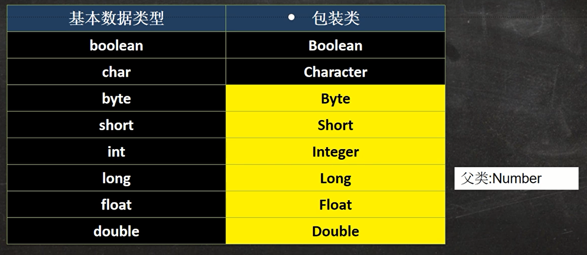
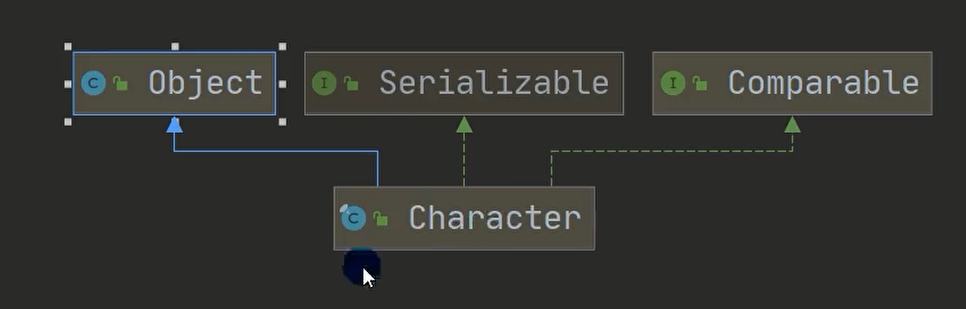
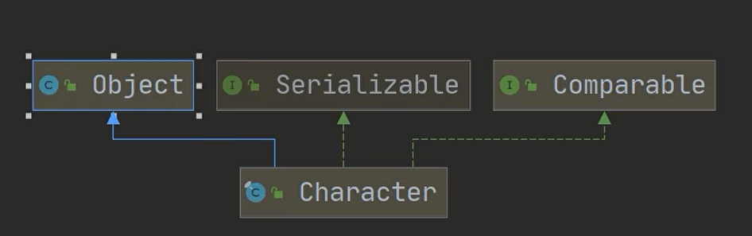
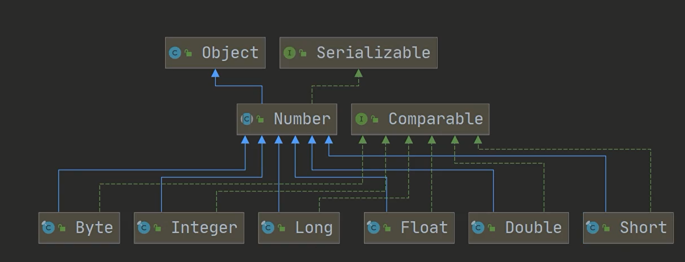
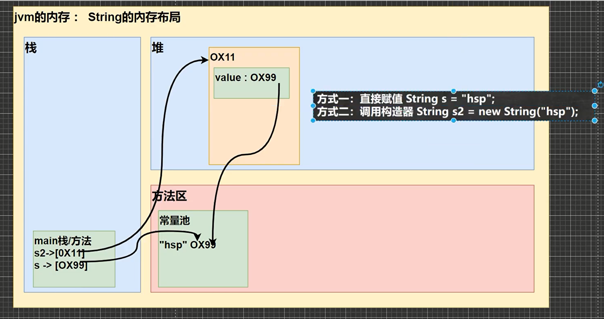

# 包装类



父类不为Number

1. boolean --> Boolean
2. char --> Character


父类为Number

1. byte --> Byte
2. short --> Short
3. int --> Integer
4. long --> Long
5. float --> Float
6. double --> Double

## 装箱与拆箱

```java
int i=1;
        Integer integer=new Integer(i);//手动装箱
        Integer integer1=Integer.valueOf(i);//手动装箱
        Integer integer2=i;//自动装箱
```

```java
int ii=integer.intValue();//手动拆箱
        int iii=integer;//自动拆箱
```

1. Integer的自动装箱本质上是调用了valueOf方法， 而valueOf方法有一个缓存机制，当数值在-128~127之间时， 会直接从缓存中取值，而不是重新创建对象。
2. Integer的自动拆箱本质上是调用了intValue方法。

上面两个特性，可以避免大量的装箱和拆箱操作，提高性能。

如果想要验证这个缓存机制，可以使用下面的代码：

```java
public class Test {
    public static void main(String[] args) {
        Integer i1 = 100;
        Integer i2 = 100;
        Integer i3 = 200;
        Integer i4 = 200;
        System.out.println(i1 == i2);
        System.out.println(i3 == i4);
    }
}
```

## String



## 创建String

```java
String s1="abc";
        String s11="abc";
        String s2=new String("abc");
        String s3=new String(new char[]{'a','b','c'});
        String s4=new String(new byte[]{97,98,99});
        String s5=new String(new byte[]{97,98,99},StandardCharsets.UTF_8);
        String s6=new String(new byte[]{97,98,99},0,3);
        System.out.println(s1==s2);//false
        System.out.println(s1==s11);//true
```

## 直接赋值

1. 直接赋值的方式，会在常量池中创建一个对象，然后将常量池中的对象的地址赋值给s1。
2. 如果常量池中已经存在了一个值为"abc"的对象，那么就不会再创建新的对象，而是直接将常量池中的对象的地址赋值给s1。
3. 如果常量池中不存在值为"abc"的对象，那么就会在常量池中创建一个对象，然后将常量池中的对象的地址赋值给s1。

## new关键字

1. 使用new关键字的方式，会在堆内存中创建一个对象，维护value属性，然后将堆内存中的对象的地址赋值给s2。
2. 如果常量池中已经存在了一个值为"abc"的对象，那么就不会再创建新的对象，而是直接将常量池中的对象的地址赋值给s2。
3. 如果常量池中不存在值为"abc"的对象，那么就会在常量池中创建一个对象，然后将常量池中的对象的地址赋值给s2。

## intern方法

当调用intern方法时，会先判断常量池中是否存在值为"abc"的对象，如果存在，就直接返回常量池中的对象的地址，如果不存在，就会在常量池中创建一个对象，然后将常量池中的对象的地址赋值给s2。

也就是说intern返回的是**常量池中的对象的地址**，而不是堆内存中的对象的地址。

## 拼接字符串

```java
String s1="hello";
        String s2=" tom";
        String s3=s1+s2;
// s1 + s2 会在堆中创建一个新的对象
// s3 指向堆中的新对象 理论上来说是创建一个空的StringBuffer对象
// 然后调用两次append方法追加s1和s2，最后调用toString方法返回一个String对象
        String s4="hello tom";
        System.out.println(s3==s4);//false
        System.out.println(s3.intern()==s4);//true
        String s5="hello"+" tom";//实际上是在编译期间就被优化成了"hello tom"
        System.out.println(s4==s5);//true
```

### 为什么debug的时候看不到new StringBuffer()

> 简单来说就是因为编译器会优化掉这个操作，所以debug的时候看不到new StringBuffer()。

#### jdk版本不同 字符串相加的底层运作是否相同

在不同的JDK版本中，字符串相加的底层运作可能是相同的，也可能是不同的。这取决于具体的实现。

在JDK1.5及之前的版本中，字符串相加操作是通过创建新的字符串对象来实现的。例如，当执行"str1" + "str2"
时，会创建一个新的字符串对象，其中包含"str1"和"str2"连接在一起的结果字符串。这种实现方式的缺点是，当需要连接多个字符串时，会创建大量的临时对象，可能会影响性能。

在JDK1.6及之后的版本中，Java引入了StringBuilder和StringBuffer两个类来优化字符串连接操作。这些类允许在一个可变的字符串缓冲区中进行操作，从而避免了创建大量的临时对象，提高了性能。在这些版本中，当执行"
str1" + "str2"时，底层运作是通过StringBuilder或StringBuffer对象来实现的。

因此，不同的JDK版本中，字符串相加的底层运作可能是不同的。但是，由于Java的向后兼容性，旧版本的代码仍然可以在新版本的JDK中运行，只是可能会使用较慢的实现方式。

#### jdk更高版本比如11以上的字符串拼接也是用的StringBuilder和StringBuffer两个类来优化字符串链接操作吗

是的，JDK
11及以上版本中字符串拼接仍然使用StringBuilder和StringBuffer两个类来优化字符串连接操作。在这些版本中，当执行字符串连接操作时，Java编译器会将其转化为对StringBuilder或StringBuffer对象的操作，从而避免了创建大量的临时对象，提高了性能。

Java 9及以上版本还引入了一种新的字符串连接方式，即使用"indify"方法连接字符串。这种方法在某些情况下可以比使用"+"
运算符连接字符串更高效，因为它会在编译时将字符串连接转化为一次调用"indify"
方法，从而避免了运行时的字符串连接操作。不过，这种方式适用于连接的字符串数量较少的情况，对于连接大量字符串的情况，仍然建议使用StringBuilder或StringBuffer。

总的来说，JDK 11及以上版本中仍然使用StringBuilder和StringBuffer两个类来优化字符串连接操作，这种方式的性能较高，可以有效避免创建大量的临时对象。

#### 为什么我debug看到的第一个方法就是internalMemberName而不是new 一个StringBuilder或者StringBuffer

这是因为在Java中，字符串连接操作可能会被编译器优化为使用内部方法。具体来说，在JDK
9及以上版本中，当使用字符串常量进行连接操作时，编译器会将其优化为调用一个内部方法"StringConcatFactory.makeConcat"
，这个方法可以根据连接的字符串数量和类型选择最合适的实现方式。

这个内部方法"StringConcatFactory.makeConcat"
会在运行时动态生成字节码来执行字符串连接操作，具体实现方式会根据连接的字符串数量和类型不同而不同。在一些情况下，这个方法会使用StringBuilder或StringBuffer来进行字符串连接操作，但是这种实现方式在字节码层面并不可见，因此在调试时可能看不到这些类的具体调用。

需要注意的是，这种优化只适用于使用字符串常量进行连接操作的情况。如果连接的字符串是变量或表达式的结果，编译器就无法进行优化了，需要使用StringBuilder或StringBuffer来手动拼接字符串。此外，尽管这种优化可以提高性能，但是并不建议在代码中过度依赖这种内部方法，因为它并不是Java语言规范中所定义的公共API，可能会在未来版本中发生变化。

#### 可以看到new StringBuffer或者StringBuilder的jdk版本吗

当使用字符串常量进行连接操作时，如"str1" + "str2"，在JDK 9及以上版本中，编译器会将其优化为调用一个内部方法"
StringConcatFactory.makeConcat"，这个方法可以根据连接的字符串数量和类型选择最合适的实现方式，包括使用StringBuilder或StringBuffer。

然而，在调试时可能会发现无法直接看到具体使用了哪种类来进行字符串连接操作。这是因为这些类的实例可能在内部方法中被创建，而且这些类的实例在创建之后很快就被丢弃，因此在调试时可能看不到这些类的具体调用。

如果想要在调试时查看具体使用了哪种类来进行字符串连接操作，可以尝试使用一些特定的代码模式。例如，可以将字符串连接操作拆分为多个步骤，每个步骤都使用StringBuilder或StringBuffer来进行字符串连接。这样在调试时，就可以看到具体使用了哪种类来进行字符串连接操作。另外，在JDK
9及以上版本中，也可以使用"StringConcatFactory"类的"makeConcatWithConstants"
方法，这个方法可以在使用字符串常量进行连接操作时，直接生成调用StringBuilder或StringBuffer的代码。

总的来说，在调试时很难直接看到具体使用了哪种类来进行字符串连接操作，因为这些类的实例可能在内部方法中被创建并且很快被丢弃。但是可以使用一些特定的代码模式或者使用"
StringConcatFactory"类的方法来查看具体的实现方式。

## StringBuffer

### 构造器

1. StringBuffer() 构造一个不带任何字符的字符串缓冲区，其初始容量为 16 个字符。
2. StringBuffer(int capacity) 构造一个不带任何字符的字符串缓冲区，其初始容量由 capacity 参数指定。
3. StringBuffer(String str) 构造一个字符串缓冲区，并将其内容初始化为指定的字符串内容。初始化后，字符串缓冲区的长度等于该字符串的长度，而其容量等于该字符串的长度加上
   16。
4. StringBuffer(CharSequence seq)
   构造一个字符串缓冲区，并将其内容初始化为指定的字符序列。该字符序列的内容和缓冲区的内容是共享的。也就是说，根据修改缓冲区的内容，字符序列的内容也会相应地发生改变。反之亦然。传入的字符序列可以是String、StringBuffer、StringBuilder等。
5. StringBuffer(CharSequence seq, int start, int end) 构造一个字符串缓冲区，并将其内容初始化为指定的字符序列的子序列。该字符序列的内容和缓冲区的内容是共享的。

### 方法

1. int capacity() 返回当前容量。容量是指用于存储字符序列的 char 数组的长度。容量至少等于字符串缓冲区的长度加上 16。
2. int length() 返回长度（字符数）。
3. char charAt(int index) 返回指定索引处的 char 值。
4. append() 追加任意类型的数据，返回值是this，即返回当前对象本身。
5. delete(int start, int end) 删除指定的内容。
6. deleteCharAt(int index) 删除指定位置的字符。
7. insert(int offset,任意类型) 在指定位置插入任意类型的数据。
8. replace(int start, int end, String str) 把[start,end)位置替换为str。
9. reverse() 把当前字符序列逆转。
10. setCharAt(int index, char ch) 把指定位置的字符设置为ch。

## StringBuffer和String的区别

1. StringBuffer是线程安全的，String是线程不安全的。
2. **String保存的是字符数组，StringBuffer保存的是字符数组的引用。**
3. String保存的是字符串常量(每次更新String类实际上就是更改地址)，StringBuffer保存的是字符串变量(
   每次都可以更改，不用更新地址)。
4. String的内容不可变，StringBuffer的内容可变。
5. String的长度是固定的，StringBuffer的长度是可变的。
6. String的效率高，StringBuffer的效率低。(因为StringBuffer是线程安全的，所以效率低)
7. String的对象是不可变的，StringBuffer的对象是可变的。

## StringBuilder

> 如果不需要线程安全(单线程下)，那么使用StringBuilder效率会更高。

## StringBuffer和StringBuilder的区别
1. StringBuffer是线程安全的，StringBuilder是线程不安全的。
2. StringBuilder的效率高，StringBuffer的效率低。(因为StringBuffer是线程安全的，所以效率低)
